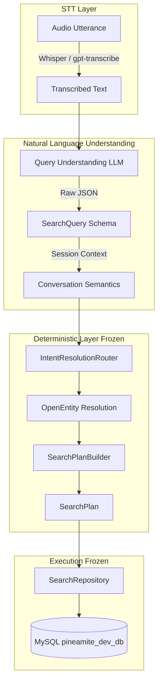

# MASTER BENCHMARKING IMPLEMENTATION PLAN — QUERY UNDERSTANDING & STT

**Status**: Ready for Execution Review  
**Branch**: `benchmark`  
**Search Architecture**: FROZEN (Query Understanding $\to$ SearchQuery $\to$ Conversation Semantics $\to$ IntentResolutionRouter $\to$ OpenEntity $\to$ SearchPlanBuilder $\to$ SearchPlan $\to$ SearchRepository $\to$ MySQL `pineamite_dev_db`)

---

## 1. Candidate Model Matrix & Live Access Verification

### A. Query Understanding (QU) Models
We strictly benchmark fast, production-plausible models (no frontier/ceiling reasoning models like o1/o3/Claude Opus/Gemini Pro):

| Provider | Target Model ID | Role | Live Access Tested | Status & Notes |
| :--- | :--- | :--- | :---: | :--- |
| **OpenAI** | `gpt-5.6-luna` | Fast production baseline | **YES (HTTP 200)** | Verified live using `max_completion_tokens`. Structured JSON output supported. |
| **Anthropic** | `claude-haiku-4-5` | Fast/efficient Haiku class | **YES (HTTP 200)** | Verified live with `CLAUDE_API_KEY`. Low-latency mode (thinking disabled). |
| **Anthropic** | `claude-sonnet-5` | Production-grade Sonnet class | **YES (HTTP 200)** | Verified live with `CLAUDE_API_KEY`. Thinking disabled / lowest reasoning mode. |
| **Google** | `gemini-3.5-flash-lite` | Ultra-fast Flash-Lite class | *Blocked by Key* | Provider adapter implemented. Current `.env` key is Anthropic-formatted (`sk-ant-a...`). Ready once `AIzaSy...` key is provided. |
| **Google** | `gemini-3.7-flash` | Flash class (low thinking) | *Blocked by Key* | Provider adapter implemented. Configured for low-latency / zero-thinking structured JSON mode. |

### B. Speech-to-Text (STT) Models
Dedicated transcription models only (no generic chat-audio models):

| Provider | Target Model ID | Type | Live Access Tested | Status & Notes |
| :--- | :--- | :--- | :---: | :--- |
| **OpenAI** | `whisper-1` | Baseline dedicated STT | **YES (HTTP 200)** | Verified in `/v1/models`. |
| **OpenAI** | `gpt-4o-mini-transcribe` | Fast dedicated STT | **YES (HTTP 200)** | Verified in `/v1/models`. |
| **OpenAI** | `gpt-transcribe` | Current dedicated STT | **YES (HTTP 200)** | Verified in `/v1/models`. |
| **Google** | `gemini-3.5-transcribe` | Dedicated Google STT | *Blocked by Key* | STT adapter designed; ready on valid Google API key. |

---

## 2. Frozen Architecture & Invariants



> [!IMPORTANT]
> **Strict Code Freeze**: The following layers are frozen and MUST NOT be modified during benchmarking:
> - Canonical prompt (`SYSTEM_PROMPT` in `backend/app/query_understanding/prompt.py`)
> - `IntentResolutionRouter`
> - `OpenEntity` scoring algorithms and match thresholds
> - `SearchPlanBuilder` & `SearchPlan` semantics
> - `SearchRepository` SQL generation
> - Conversation session semantics

---

## 3. Gold Query Dataset Creation Plan

### A. Size & Intent Coverage
Target size: **~390 high-quality query cases** covering all 9 canonical intents:
1. `SEARCH_RALLIES`
2. `SEARCH_DRIVER_RALLIES`
3. `SEARCH_DRIVER_WINS`
4. `GET_RALLY_RESULTS`
5. `GET_RALLY_TOP_FINISHERS`
6. `SEARCH_VIDEO_ACTIONS`
7. `SEARCH_DRIVER_VIDEOS`
8. `GET_TOP_UPLOADERS`
9. `GET_TOP_DRIVERS_BY_WINS`

### B. Distribution Breakdown
| Category | Target Count | Description |
| :--- | :---: | :--- |
| **1. Simple single-filter** | ~50 | Single country, single driver, single year, or single action |
| **2. Multi-filter** | ~60 | Driver + rally + year + action combinations |
| **3. Entity-heavy** | ~60 | Precise rally names, stage names, co-drivers, and competitor roles |
| **4. Misspellings / Phonetic Noise** | ~50 | Programmatic perturbations (character deletion, vowel swaps, missing diacritics, transposed letters) |
| **5. Multi-value same-dimension** | ~40 | Multiple drivers ("Josh or Sam", "both Josh and Sam"), multiple countries, multiple years |
| **6. Ambiguity / Clarification** | ~30 | Broad unconstrained queries ("find clips", "results"), ambiguous pronouns |
| **7. Conversation / Referents** | ~40 | Multi-turn queries with `[Context: ...]`, pronoun resolution, additive action filters |
| **8. Video / Action queries** | ~40 | Canonical action mappings across languages (jump, drift, crash, spin, donut, hairpin, water splash, etc.) |
| **9. Realistic / Adversarial** | ~20 | Mixed word order, idiomatic motorsport phrasing |
| **Total** | **~390** | |

### C. Grounding in Real Database Entities
Entities are deterministically sampled from the current snapshot of `pineamite_dev_db`:
- **Rallies**: 111 events (`rally_events`)
- **Stages**: 1,025 special stages (`rally_stages`)
- **Drivers**: 4,515 drivers (`user_driver_profile`)
- **Co-Drivers**: 4,238 co-drivers (`user_codriver_profile`)
- **Actions**: 9 canonical action types (`drift`, `jump`, `crash`, `spin`, `donut`, `hairpin`, `water splash`, `start line`, `near miss`, `mechanical failure`, `offroad`, `stuck`)
- **Countries**: 189 countries (`countries`)
- **Uploaders & Videos**: Sampled from 42,357 entries (`rally_videos`)

### D. Immutable Regression Bucket
The following cases are permanently fixed in the dataset and never programmatically regenerated or modified:
1. `aluqsne`
2. `Rally aluqsne`
3. `aluksnay`
4. `donegl`
5. `max freemn`
6. `Rallies in Ireland`
7. `Rallies in 2025`

### E. Gold Case Format (`query_understanding_gold.jsonl`)
```json
{
  "case_id": "qu_0142",
  "category": "entity_heavy",
  "input_text": "Show jumps featuring Josh Moffett from Moonraker 2025",
  "conversation_context": null,
  "expected": {
    "intent": "SEARCH_VIDEO_ACTIONS",
    "countries": [],
    "cities": [],
    "years": [2025],
    "yearFrom": null,
    "yearTo": null,
    "rallyNames": ["Moonraker"],
    "eventNames": [],
    "stageNames": [],
    "stageNumbers": [],
    "driverNames": ["Josh Moffett"],
    "driverIds": [],
    "actionTypes": ["jump"],
    "uploaders": [],
    "personRole": "ANY",
    "driverMatchMode": "ANY"
  },
  "expected_resolution": {
    "outcome": "RESOLVED",
    "canonical_entities": [
      {"type": "DRIVER", "canonical_id": "...", "canonical_name": "Josh Moffett"},
      {"type": "RALLY", "canonical_id": "...", "canonical_name": "Moonraker Forestry Rally"}
    ]
  },
  "metadata": {
    "generation_source": "template_db_derived",
    "gold_confidence": "high",
    "validated_against_db": true
  },
  "notes": "Standard multi-filter video action query with real DB driver and rally"
}
```

### F. Dataset Quality Control & Validation (`validate_gold_dataset.py`)
A strict pre-flight dataset QA validator verifies:
- [x] Every intent belongs to the 9 canonical `SearchIntent` values
- [x] Schema validity and field name consistency
- [x] Year range logic ($yearFrom \le yearTo$, valid 4-digit years)
- [x] All referenced canonical entities exist in MySQL tables
- [x] No duplicate `case_id` or duplicate `input_text` within non-conversational categories
- [x] All conversational cases contain valid structured context
- [x] Clarification cases are explicitly marked and semantically ambiguous
- [x] Generates a markdown QA report `dataset_qa_report.md` before benchmark execution.

---

## 4. Benchmark Harness & Metrics

### A. Directory Structure
```
backend/benchmarks/
├── BENCHMARK_IMPLEMENTATION_PLAN.md
├── datasets/
│   ├── query_understanding_gold.jsonl
│   ├── stt_manifest.jsonl
│   ├── dataset_qa_report.md
│   └── validate_gold_dataset.py
├── providers/
│   ├── __init__.py
│   ├── base.py
│   ├── openai_qu.py
│   ├── anthropic_qu.py
│   ├── gemini_qu.py
│   ├── openai_stt.py
│   └── gemini_stt.py
├── scoring/
│   ├── __init__.py
│   ├── query_scoring.py
│   ├── system_scoring.py
│   ├── stt_scoring.py
│   ├── latency.py
│   └── cost.py
├── runners/
│   ├── __init__.py
│   ├── run_provider_discovery.py
│   ├── run_smoke_test.py
│   ├── run_calibration.py
│   ├── run_qu_benchmark.py
│   ├── run_stt_benchmark.py
│   └── run_e2e_voice_benchmark.py
└── results/
    └── <timestamp>/
        ├── qu_raw_results.jsonl
        ├── qu_summary.csv
        ├── qu_failures.jsonl
        ├── system_results.jsonl
        ├── latency_summary.csv
        ├── cost_summary.csv
        └── benchmark_report.md
```

### B. Raw Query Understanding Metrics (Pre-Recovery)
1. **Schema Validity Rate**: % of responses conforming to strict JSON schema without syntax or parse errors.
2. **Intent Accuracy**: Exact match on target `SearchIntent`.
3. **Exact SearchQuery Match**: Exact match across intent and all filter fields (after case-insensitive & whitespace normalization).
4. **Field-Level Precision, Recall, and F1**: Micro and macro averaged across all list and scalar fields.
5. **Wrong-Field Rate (Critical Metric)**:
   - Measures when an entity mention is extracted into the incorrect dimension (e.g. input `"max freemn"`, expected `driverNames=["max freemn"]`, actual `rallyNames=["max freemn"]`).
   - Downstream OpenEntity repair DOES NOT mask this raw model error.
6. **Hallucinated-Field Rate**: Rate of inventing filters not present in the input text.
7. **Multi-Value Completeness**: Accuracy of preserving all items in multi-value lists (e.g. `"Josh Moffett or Sam Moffett"` $\to$ 2 elements).
8. **PersonRole & MatchMode Accuracy**: Correct extraction of `"DRIVER" | "CO_DRIVER" | "ANY"` and `"ALL" | "ANY"`.

### C. System-Level Metrics (End-to-End Localhost Pipeline)
Evaluating the parsed `SearchQuery` through `Conversation Semantics` $\to$ `Router` $\to$ `OpenEntity` $\to$ `SearchPlanBuilder` $\to$ `MySQL`:
1. **Correct Canonical Resolution Rate**: % of entities correctly matched to database IDs.
2. **Correct SearchPlan Rate**: % of generated executable SearchPlans matching target execution semantics.
3. **Clarification Success Rate**: Correctly triggering clarification on ambiguous inputs (clarification $\neq$ failure).
4. **Safe No-Match Rate**: Correctly returning no-match on nonexistent entities without false hallucinations.
5. **False Confident Execution Rate (Severe Failure)**: Executing a confident incorrect search on ambiguous/invalid input.
6. **Router Recovery Rate**: Errors in raw QU repaired by deterministic router rules.
7. **OpenEntity Recovery Rate**: Noisy/misspelled entity names repaired by phonetics/cascade scoring.

### D. Latency Profiling Methodology
- **Warm-up**: 3 un-timed requests per model prior to timing run.
- **Randomized Execution**: Case execution order randomized across providers to prevent temporal bias.
- **Bounded Concurrency**: Bounded worker pool (e.g. concurrency = 4) to avoid rate limits or CPU contention.
- **Component Breakdown**:
  - `t_QU`: Raw provider API round-trip latency
  - `t_Router`: Intent routing latency
  - `t_OpenEntity`: Database cascade & candidate scoring latency
  - `t_SearchPlan`: Search plan construction latency
  - `t_DB`: MySQL query execution latency
  - `t_Total`: Complete localhost request latency
- **Percentiles Reported**: p50, p90, p95, p99, and Max.

### E. Cost & Token Accounting
- Capture exact token usage for each request: `input_tokens`, `output_tokens`, `cached_tokens`, `reasoning_tokens`.
- Compute:
  - Estimated Cost per 1,000 queries
  - Estimated Cost per 100,000 queries
- Pricing model defined in configurable `pricing_config.json` with verified rates.

---

## 5. STT Benchmark Plan

### A. Audio Manifest (`stt_manifest.jsonl`)
- 100–150 audio utterances categorized by track:
  - **Track A (Synthetic Controlled)**: High-fidelity multi-lingual audio from `test/eval/audio/synthetic` (19 languages, clean & noisy acoustic variants).
  - **Track B (Human Recordings)**: Real human recordings from `test/eval/audio/human` (`asim1.wav`, `asim2.wav`, etc.).
- Manifest Schema:
  ```json
  {
    "case_id": "stt_0012",
    "audio_path": "test/eval/audio/synthetic/en_01.mp3",
    "reference_text": "Show jump highlights from Moonraker 2025",
    "entities": [
      {"text": "jump", "type": "ACTION"},
      {"text": "Moonraker", "type": "RALLY"},
      {"text": "2025", "type": "YEAR"}
    ],
    "language": "en",
    "noise_class": "clean",
    "speaker_type": "synthetic"
  }
  ```

### B. STT Metrics
1. **Word Error Rate (WER)** (normalized for punctuation and case).
2. **Entity Preservation Rate (EPR)**: % of canonical entities in reference text present in transcription.
3. **Rally-Name Accuracy**: % exact/phonetic retention of rally titles.
4. **Person-Name Accuracy**: % retention of driver and co-driver names.
5. **Stage-Name Accuracy**: % retention of stage names.
6. **Action & Year Accuracy**.
7. **Transcription Latency**: p50 and p95 ms.
8. **Cost per audio minute**.

### C. STT Vocabulary Biasing Experiment
Compare transcription accuracy across two conditions:
- **Condition 1 (Vanilla)**: Standard zero-shot STT without prompt hints.
- **Condition 2 (DB Vocabulary Biased)**: STT with canonical prompt hint derived strictly from DB entity vocabulary (no typo dictionaries or hand-crafted aliases).

---

## 6. End-to-End Voice Benchmark

For the top 1–2 QU models and top 1–2 STT models:
$$\text{Audio} \xrightarrow{\text{STT}} \text{Transcript} \xrightarrow{\text{QU}} \text{SearchQuery} \xrightarrow{\text{Router}} \text{OpenEntity} \xrightarrow{\text{SearchPlan}} \text{MySQL}$$

**Primary Metric**: **End-to-End Correct Search Outcome**
- Correct Results Returned
- Safe / Correct Clarification Prompted
- Safe No-Match
- False Confident Execution Rate

---

## 7. Step-by-Step Execution Phases


### Phase A: 25-Case Smoke Test (`run_smoke_test.py`)
- Test all live models (`gpt-5.6-luna`, `claude-haiku-4-5`, `claude-sonnet-5`, `whisper-1`, `gpt-transcribe`).
- Validates end-to-end connectivity, token counting, structured parsing, and localhost pipeline integration.
- Generates `smoke_test_report.md`.

### Phase B: 100-Case Calibration Run (`run_calibration.py`)
- Verifies evaluator correctness, list comparison, wrong-field penalties, conversation context handling, and clarification scoring.
- Confirms zero regressions in scoring logic before the full benchmark run.

### Phase C: Full Frozen Benchmark (~390 Cases) (`run_qu_benchmark.py`)
- Complete evaluation of all candidate models against the validated gold dataset.
- Produces `qu_raw_results.jsonl`, `system_results.jsonl`, `latency_summary.csv`, `cost_summary.csv`.

### Phase D: STT & E2E Voice Benchmark (`run_stt_benchmark.py` & `run_e2e_voice_benchmark.py`)
- Evaluates STT candidates across synthetic and human audio sets with and without vocabulary biasing.
- Evaluates shortlisted finalist pairs end-to-end.

### Phase E: Model Selection & Final Report
Applies hard gates:
1. Schema validity $\ge 99\%$
2. False confident resolution rate $\approx 0\%$
3. Safe clarification behavior
4. No critical intent failures

Ranks surviving models on:
- Best Overall System Success Rate
- Best Latency (p95)
- Best Cost per 100k queries
- Best Raw Entity/Field Accuracy

Outputs final markdown report to `backend/benchmarks/results/<timestamp>/benchmark_report.md`.

---

## 8. Estimated Request Counts & Cost Model

| Phase | Cases | Candidate Models | Total Requests | Estimated API Cost |
| :--- | :---: | :---: | :---: | :---: |
| **Phase A (Smoke)** | 25 | 3 QU + 2 STT | 125 | $<\$0.15$ |
| **Phase B (Calibration)** | 100 | 3 QU | 300 | $<\$0.40$ |
| **Phase C (Full QU)** | ~390 | 3 QU | ~1,170 | $\approx \$1.50 - \$2.50$ |
| **Phase D (STT & E2E)** | 120 | 2 STT $\times$ 2 conditions + 2 E2E pairs | ~720 | $\approx \$1.00 - \$2.00$ |
| **Total Benchmark** | | | **~2,315** | **$\approx \$3.00 - \$5.00$** |

---

## 9. Planned Execution Commands

```bash
# 1. Generate & Validate Gold Dataset against live DB
cd backend
source .venv/bin/activate
python -m benchmarks.datasets.validate_gold_dataset

# 2. Run Phase A: 25-case Provider Smoke Test
python -m benchmarks.runners.run_smoke_test

# 3. Run Phase B: 100-case Calibration Run
python -m benchmarks.runners.run_calibration

# 4. Run Phase C: Full QU Benchmark
python -m benchmarks.runners.run_qu_benchmark

# 5. Run Phase D: STT & E2E Voice Benchmark
python -m benchmarks.runners.run_stt_benchmark
python -m benchmarks.runners.run_e2e_voice_benchmark
```

---

## 10. Risks & Blockers

1. **Google Gemini API Key**: In `.env`, `GEMINI_API_KEY` currently contains an Anthropic-formatted key (`sk-ant-a...`). If a valid Google API key (`AIzaSy...`) is added, `gemini-3.5-flash-lite` and `gemini-3.7-flash` will automatically run alongside OpenAI and Anthropic without code changes.
2. **STT Human Audio Set**: While 6 human recordings exist in `test/eval/audio/human`, Track A (synthetic audio) will provide full statistical coverage while Track B (human) serves as the validation gate. Final production STT selection will not rely solely on synthetic TTS.
